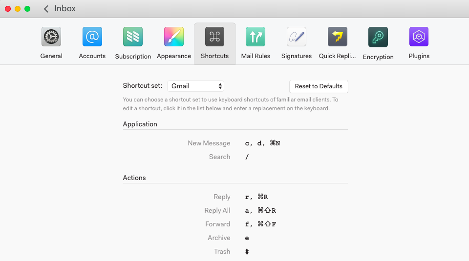

# Using and customizing keyboard shortcuts

N1 comes pre-loaded with several common keyboard shortcut configurations. Go to Preferences > Shortcuts to change the set it uses.

If you want even more specific control over your keyboard shortcuts, you can edit a file that will override any defaults.

On Mac and Linux, edit the file at: "~/.nylas/keymap.json"

On Windows the file should be at: "C:\Users\Your Name\.nylas\keymap.json". The ".nylas" folder is hidden and you may need to go to View > Hidden Items.

If the file doesn't exist, simply make one called "keymap.json" in the ".nylas" folder.

You can then enter a mapping between a sequence of keys and an action to take. See the following two examples for the exact syntax to use and the available commands:

1.  Here are all of the default keymaps used in N1: [https://github.com/nylas/N1/blob/master/keymaps/base.json](https://github.com/nylas/N1/blob/master/keymaps/base.json)

2.  Here are more keymaps for those that have Gmail-style keymaps enabled: [https://github.com/nylas/N1/blob/master/keymaps/templates/Gmail.json](https://github.com/nylas/N1/blob/master/keymaps/templates/Gmail.json)

Any entries you add to your own "~/.nylas/keymap.json" file will override the defaults. Use the same syntax as the two example files above. The list of available actions can be found in the example files.

Take careful note that in the examples, keyboard shortcuts are scoped under "body:" or "'body *[contenteditable].contenteditable':". You must also scope your custom keyboard shortcuts under the appropriate heading (see examples).

