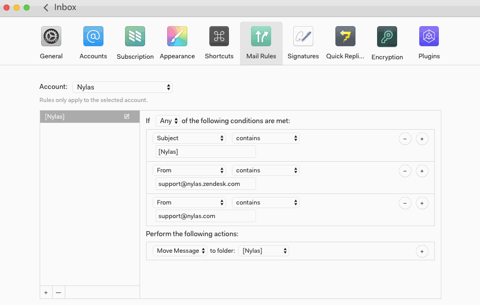

# Managing your inbox with mail rules

Set up and manage mail rules at Preferences > Mail Rules.

Mail rules help you manage your inbox more easily by automating the handling of certain incoming messages.

To set up a new mail rule, define the conditions you want to use to select messages, then define the action (or actions) you want to take on messages that meet the criteria.

By default, mail rules are applied to incoming mail as it arrives. If you’d like to apply a new rule to your entire inbox immediately after you create it, you can click “Process entire inbox.” This processing may take some time depending on the size of your inbox.

