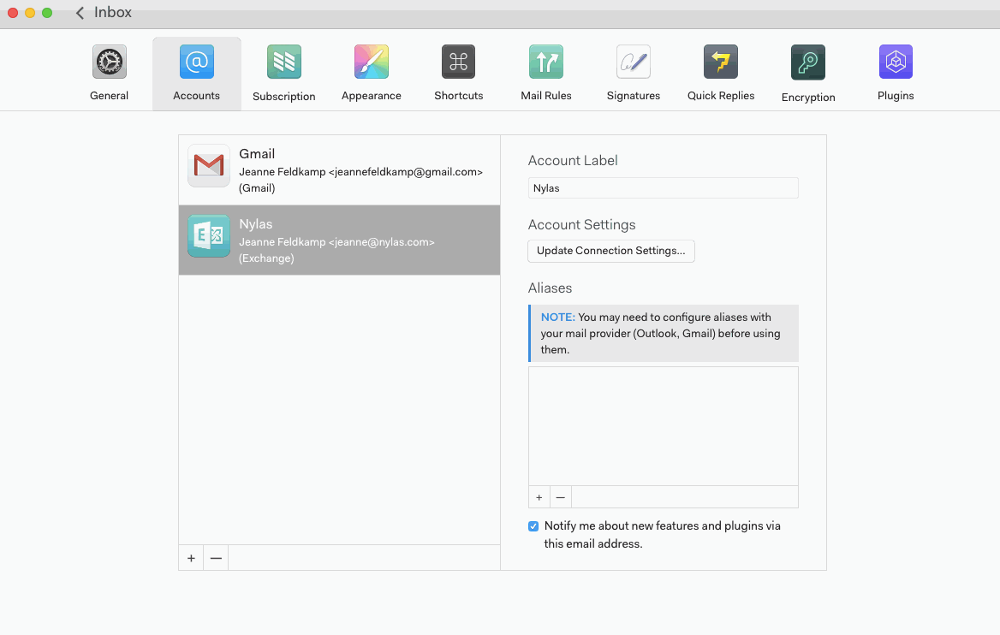
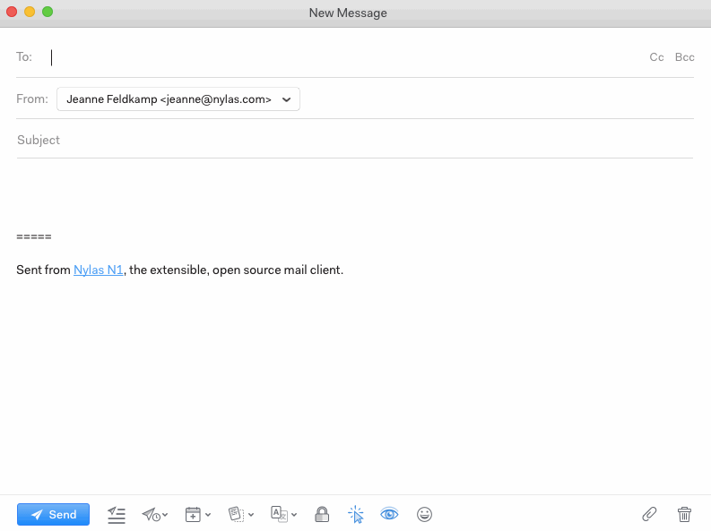

# Aliases

To set up an alias in Nylas Mail, go to Preferences > Accounts, choose the proper account, and click “+” at the bottom of the list of aliases. Enter the name and email address you want to send from.

All of your aliases are available in a dropdown when you compose a new message.

