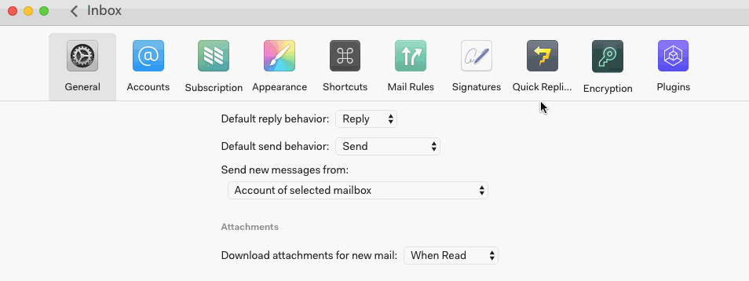

# Offline account access

Nylas Mail allows you to read, compose, and schedule messages as usual while offline.

Your ability to see images and attachments while offline depends on how you’ve configured Nylas to download attachments. These are your options:

*   **When received** provides maximum readability and access while offline
*   **When read** means you will only be able to view images and attachments you have previously opened if you go offline
*   **Manually**

Messages you send while offline will be queued and sent when you reconnect to the internet.

