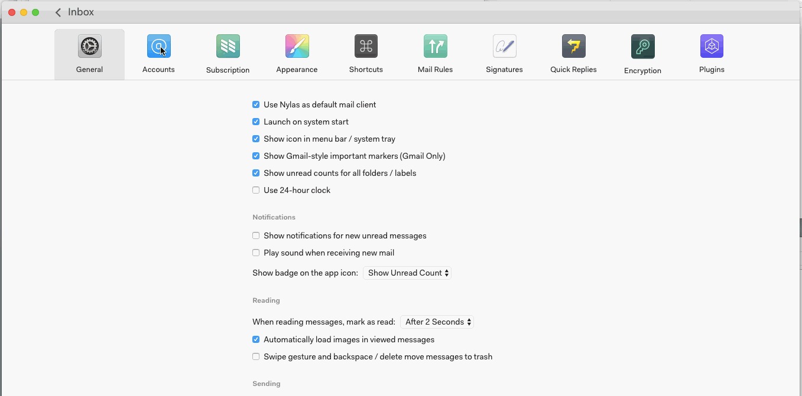

# Setting up multiple accounts

You can set up as many email accounts as you like within N1\. Go to Preferences > Accounts and click “+” at the bottom of the accounts list.

Once you complete the setup process, your messages, folders, and labels will be imported.

