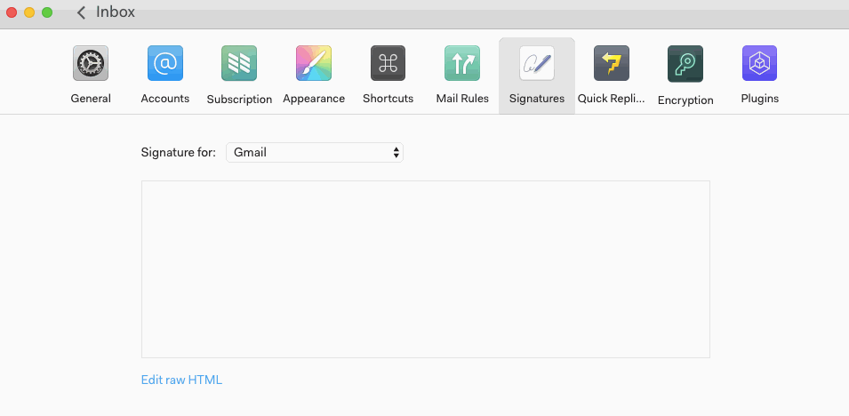

# Creating signatures

To manage your signatures, go to Preferences > Signatures.

You can type a signature using the standard text editor (with bold, underline, links, and so on), or switch to "Raw HTML" mode and paste a signature from another application.

Currently N1 supports a single signature for each account. We'll be expanding signature support soon so you can multiple signatures for each account, or add a signature for a specific alias.

To add images to your signature, you need to upload the images to the web and add them to the signature HTML using IMG tags. N1 does not currently support adding images via message attachments. For example:

 

