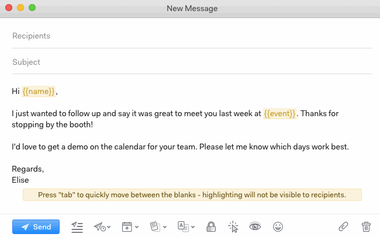
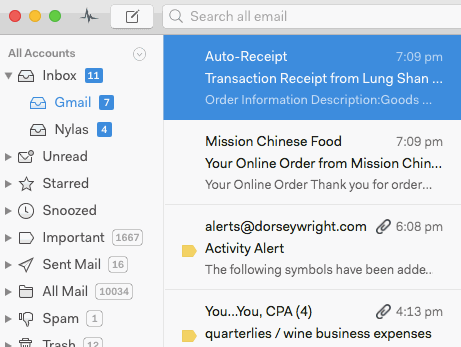

# Tracking and notifications

To enable link tracking for a message, click the Link Tracking icon at the bottom of your message.

To enable open tracking, click the Open Tracking icon at the bottom of your message.

When messages you have tracked are opened or clicked, notifications will appear in a feed above your list of accounts. Click the Activity icon to review your notifications.

