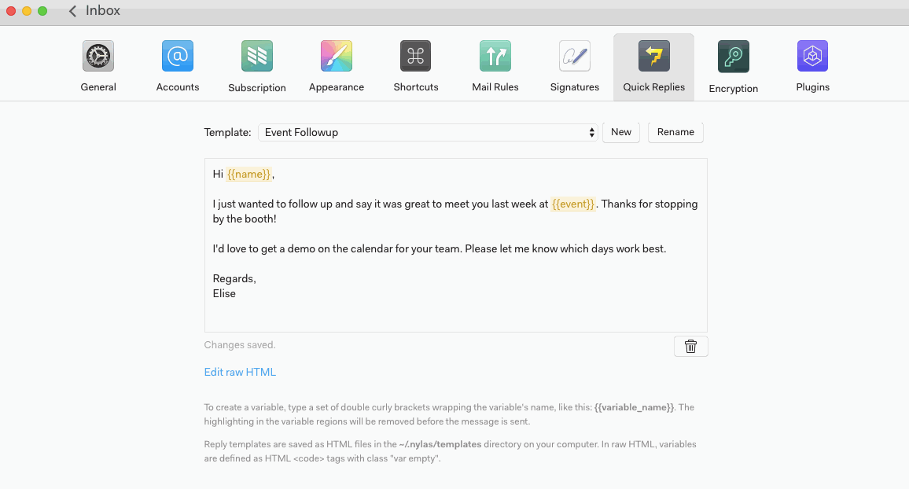
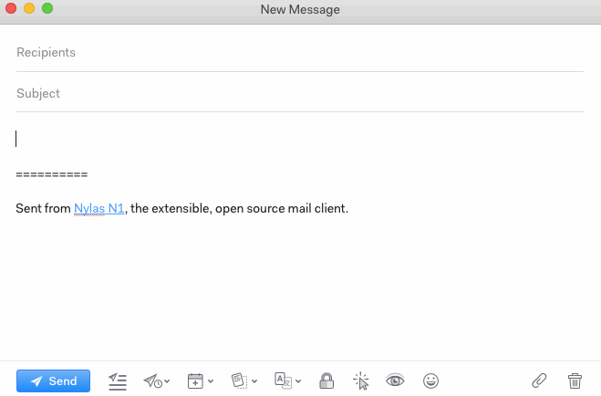

# Using quick reply templates

Go to Preferences > Quick Replies to create templates you can use to save time when sending messages.

To use a saved template, open a new message and click the Templates icon at the bottom. Select the template you want to use, then replace each highlighted variable.

