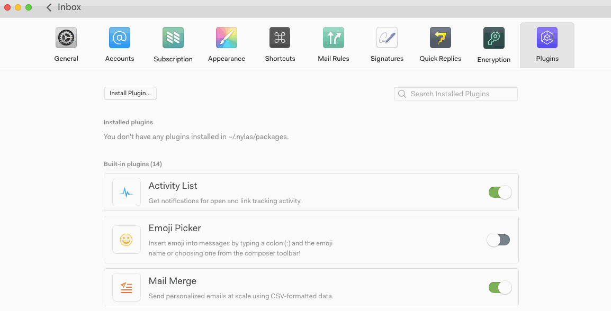

# Activating plugins

Plugins add new functionality to N1\. You can activate or deactivate them at any time.

More than a dozen plugins are built in directly to N1\. Go to Preferences > Plugins to see a list of what’s available, then toggle to install.

Developers can clone or download additional N1 plugins via [GitHub](https://github.com/nylas/n1). Installation instructions are [here](/hc/en-us/articles/216123077). Many of these are community-contributed, and the selection will continue to grow over time.

