

# Choose Nylas Mail as the default mail client on Windows

_[Important Note: These instructions only apply to the latest versions of Nylas Mail.]_

Run Nylas Mail and click the menu in the top right to visit **Preferences**.

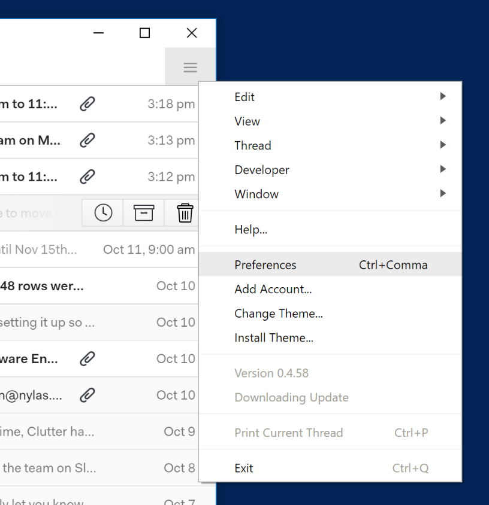

Under the General tab, click "**Use Nylas as the default mail client.**" If you're using Windows 7, you need to click "Yes" in the UAC dialog that appears. If you're using Windows 8 or Windows 10, follow the additional instructions listed below.

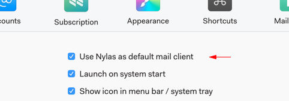

**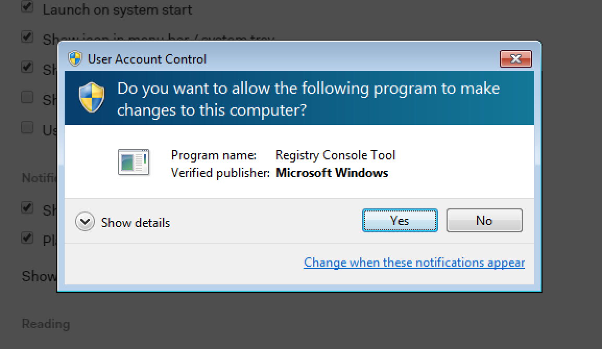** 

**Additional Steps for Windows 10:**

After following the steps above in Nylas Mail, from the Start menu, choose "**Settings**":

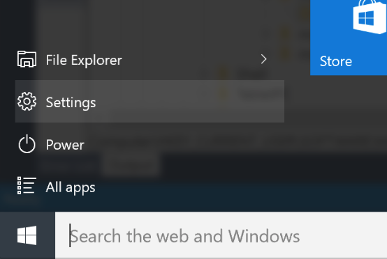

Click "**System**" to go to system settings. Then choose "**Default Apps**" from the sidebar:

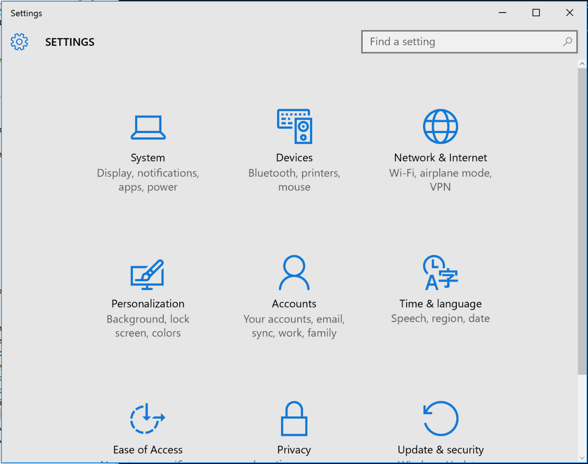

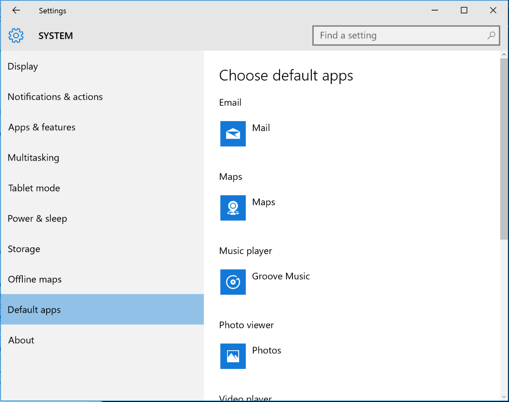

**Additional Steps for Windows 8:**

After following the instructions above in Nylas Mail choose "**Settings**" from the Start Menu. Then click "**Search and Apps**":

**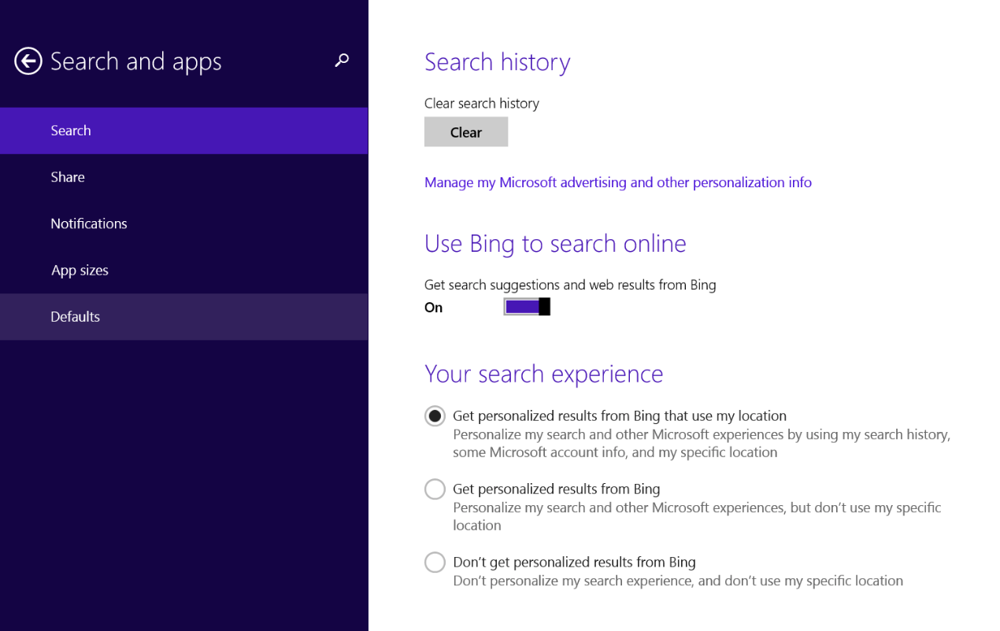**

From the left sidebar, click "**Defaults**". Click "**Email**" and choose "**Nylas N1**" from the list.

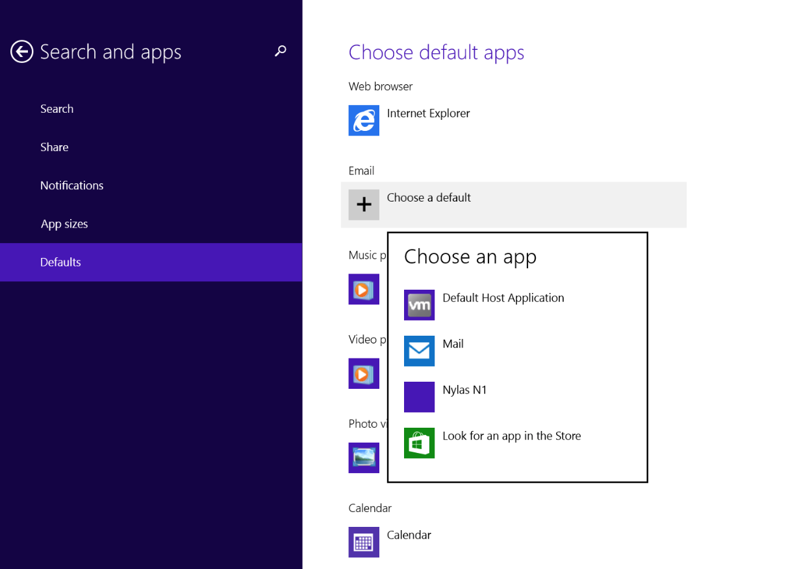

**Windows 7:**

**Following the steps above are all you need to do to make Nylas Mail your default mail client.** To edit your default mail client after following those instructions, use "**Default Programs**". You'll find Default Programs" under the Start Menu:

**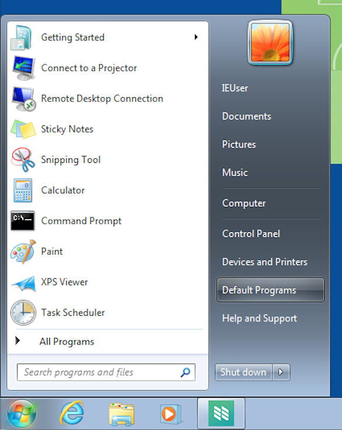 **

Click "**Set your Default Programs**" from the list of options:

**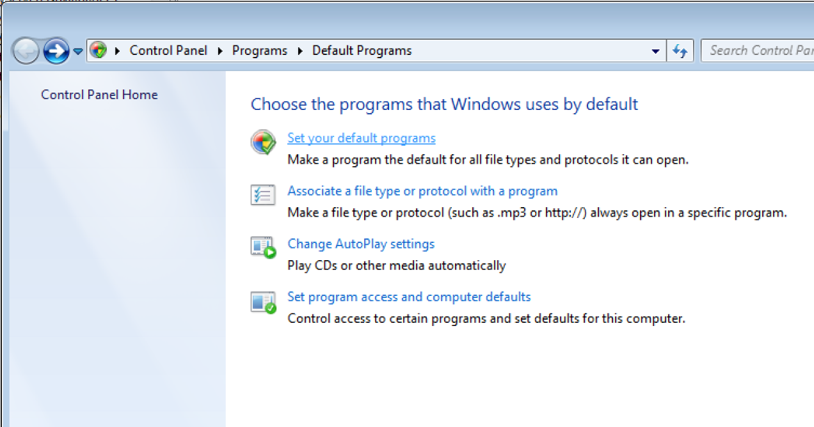**

Choose **Nylas Mail** from the left sidebar, and then click "**Set this program as default.**"

**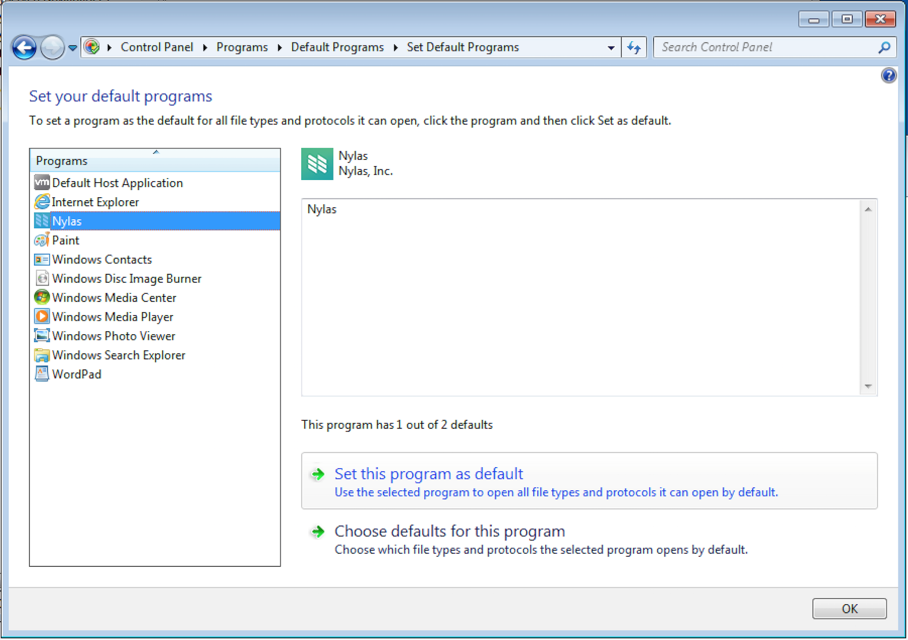**

