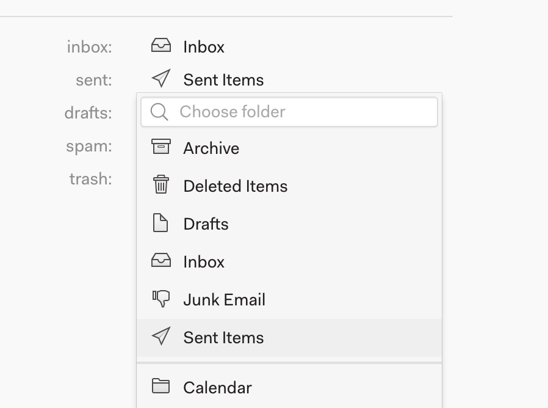

# Custom Folder Mappings

Nylas Mail supports customer folder mappings for popular folders like 'Sent', 'Inbox', and more.

In order to set a custom folder open 'Preferences' and navigate to 'Folders'

There you'll see the following interface

Which will allow you to select custom mappings:

