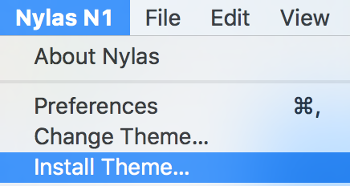
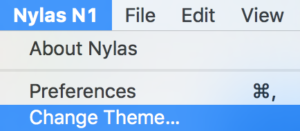
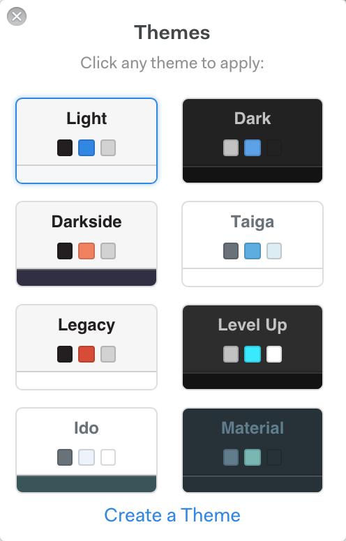

# How do I change my theme?

1.  First, if you want to install a new theme, you can do it by finding a theme you like (we have a [list](https://github.com/nylas/N1)!) and using `git clone` or downloading the ZIP to your computer. Then, go to "Nylas Mail" -> "Install Theme..." in the menu and choose the directory for your theme. It should automatically become your active theme once it's installed.

    

2.  If you want to change your theme to another theme you have installed, go to "Nylas Mail" -> "Change Theme..." in the menu.

    

3.  The theme picker shows all of the themes you have installed. Just click the one you want to change the theme!

    

