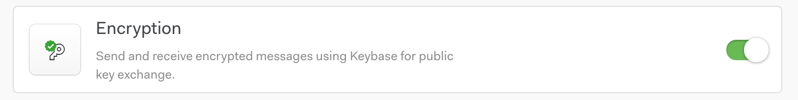
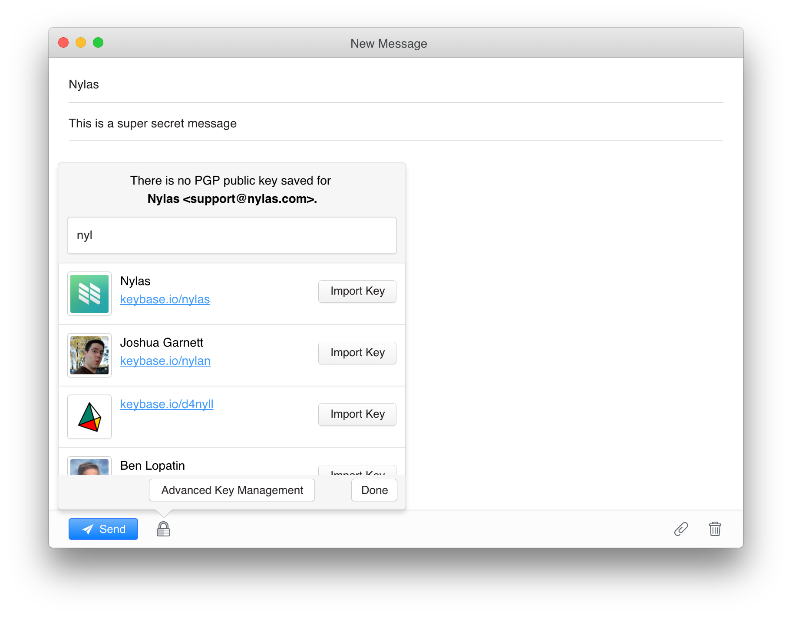

# PGP Nylas Mail Plugin: Getting Started Guide

The Nylas PGP plugin for Nylas Pro (formerly N1) is a simple tool for end-to-end encryption and decryption of email message bodies. It's designed to make PGP encryption easy and intuitive and is integrated closely with Keybase for public key importing.

Enabling the PGP Plugin

The Nylas PGP plugin is disabled by default. To enable it, open Nylas Mail's preferences, select the "Plugins" tab, find the "Encryption" plugin, and flip the toggle. You should now see the small lock icon in your composer window.

Sending an encrypted message

Get started with the PGP plugin by sending your first encrypted message from Nylas Mail. First, open a new message composer. Add recipients and draft your message. When you're ready to send your message, hit the Encrypt button at the bottom of the composer (it looks like a little lock).

If you already have a PGP public key stored in Nylas Mail for every message recipient, the button "just works"—it replaces your message with an encrypted block. Otherwise, if you're missing a PGP public key for one or more recipients, the Encrypt button will open a popover so that you can search Keybase for your friends' PGP public keys. Make sure to put your own public key up on Keybase so that your friends can find you easily through Nylas!

If you don't have a Keybase account, no worries—you can get an invite on the Encryption Preferences page. If your friends aren't on Keybase, you can manually import their public keys from that same Preferences page, then come back and finish your message. Once your message body is encrypted and ready to go, send it out to your intended recipients, safe in the knowledge that only they can read it.

Decrypting received messages

Before you can decrypt any messages encrypted with your public key, you must first import the associated private key into Nylas Mail. The first step is getting your private key. If you saved your private key to Keybase, you can export it by clicking the "edit" button under your username, next to the key symbol and the associated key fingerprint. If it's stored in GPG, you can export it to file with `gpg --export-secret-key -a "User Name" > private.key`. Regardless of where your key came from, once you have it, you can head to the Encryption Preferences page and use one of the "Add a PGP Key" buttons to import it into N1.

When you receive a message with an encrypted block, Nylas Mail should automatically detect that the message is encrypted and offer you a Decrypt button above the body in the message view. Click the Decrypt button and enter the password for your PGP private key. If the password is correct and the message was encrypted properly using your matching public key, it should be decrypted just like that! Your private key password is automatically cached for 30 minutes after each use. After that, you'll have to enter it again.

If, instead of an encrypted block, your message has an `encrypted.asc` attachment, execute the exact same process, but with the Decrypt Attachment button instead of the Decrypt button. You can save the decrypted contents of `encrypted.asc` wherever you like, to be opened later.

Key management

PGP keys in Nylas Mail's Keybase plugin are managed on the Encryption tab of Nylas Mail's Preferences page.

From this page, you can import PGP keys from file, paste them in manually, search Keybase by name and username, associate new emails with existing keys, export keys, delete keys, and even generate new PGP keypairs using Keybase's kbpgp library.

FAQ 

**Can I sign messages with Nylas Mail?**

Not yet, but we're working on it! Unfortunately, clearsigning messages is much more difficult than encrypting them, since the message cleartext must make it to the other provider unaltered. Some mail providers (e.g. Gmail) automatically edit HTML-formatted emails (like the ones Nylas sends) to remove certain HTML tags or make links "data-safe." Preventing this would require either implementing PGP/MIME on the Nylas Mail backend or adding a plaintext message composer to Nylas Mail, neither of which is trivial.

**Can I upload and download encrypted attachments with Nylas Mail?**

This feature, too, is in the works. Downloading encrypted.asc files like those sent by Enigmail is currently supported, but attachments sent from Nylas are currently not encrypted, even if the message body is.

**Where are the PGP keys used by Nylas Mail stored?**

Keys imported into N1 via the Encryption Preferences page or the Encrypt button's Import popover are stored in `$HOME/.nylas/keys`, and nowhere else. The contents of your PGP keys never leave your machine.

**Can I automatically import keys from non-Keybase keyservers, like the MIT PGP keyserver or the Ubuntu keyserver?**

Not yet. We're working on a feature that will let you import such keys from the Encryption Preferences page. Importing keys from the message composer will likely remain Keybase-exclusive for the forseeable future.

**How does the Keybase plugin interact with the Nylas Cloud?**

By and large, the unencrypted contents of your messages never touch Nylas servers. There are only two cases in which the plaintext contents of an encrypted message could ever be synced to the Nylas Cloud. To avoid them, we recommend composing all encrypted messages entirely within Nylas and not encrypting messages after you have already scheduled them to send later.

1.  If you compose a draft, hit Send Later, and subsequently go back to encrypt the draft, it's too late—the plaintext message has already been stored on Nylas' servers. Hitting Send Later sends a copy of your message to the Nylas Cloud so that it can be... well... sent later. Unfortunately, we do not yet auto-detect drafts becoming encrypted after being initially sent to our servers for Send Later.

2.  If you start composing a message in Gmail's web interface, then the message draft syncs to Nylas Mail and you continue to edit it there, the draft is (for consistency) synced back to Gmail through the Nylas Cloud while you edit in in Nylas Mail. You should assume that any message initially composed in Gmail web before being encrypted in Nylas Mail has already been sent in plaintext, by both Gmail and Nylas Mail, to the Nylas Cloud.

Email [support@nylas.com](mailto:support@nylas.com) with any further questions about Nylas Mail's Keybase plugin!

