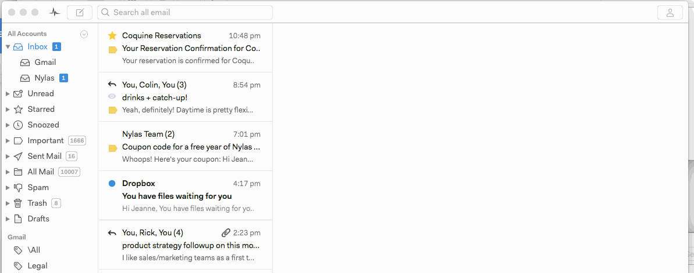
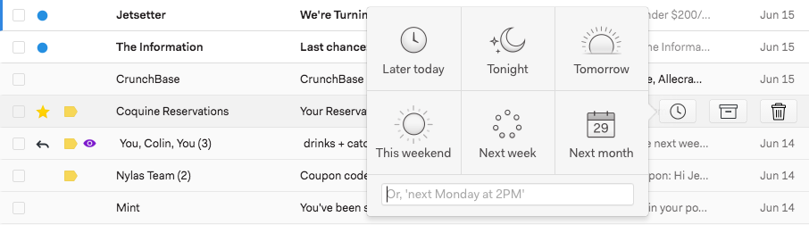

# Snoozing messages

There are three ways to snooze a message.

1. **Swipe left** over the message in your inbox.

****

2. When in single panel mode, **hover** over the message and click the Snooze icon. 

3\. While reading a message, **click the Snooze icon** at the top of the message window. Then choose when you’d like the message to reappear.

