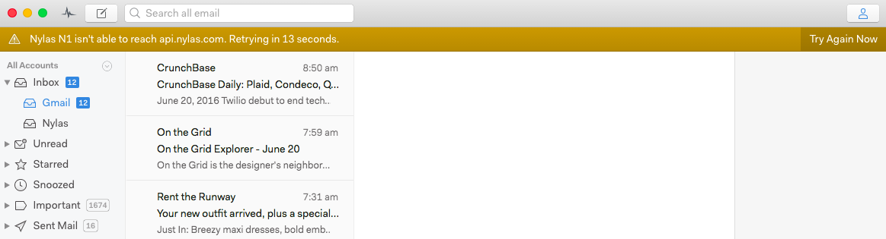

# Checking for new mail

Nylas Mail continuously syncs with the mail server, so messages appear as soon as they’re available on the server. Nylas Mail will automatically reconnect and sync after being disconnected.

If you lose your connection, Nylas Mail will display an alert at the top of your window. 

We are looking into ways of improving offline status indicators in the future so it's more clear whether Nylas Mail is actively syncing your mail.

