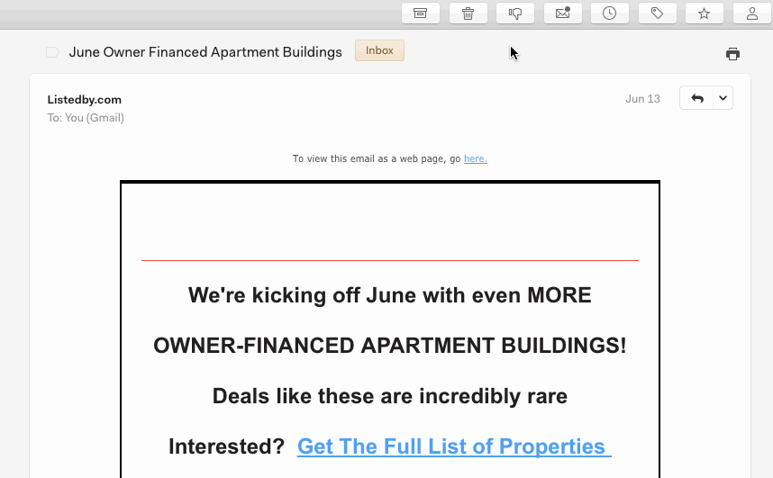

# Marking messages as spam

To mark a thread as spam inside Nylas Mail, you can move it to your Spam label for Gmail accounts, or move it to your Junk Email folder for Exchange or other accounts. You can also click the Spam icon while reading a message.

For Gmail users, please make sure you have the Spam option checked to On inside your IMAP Settings.

