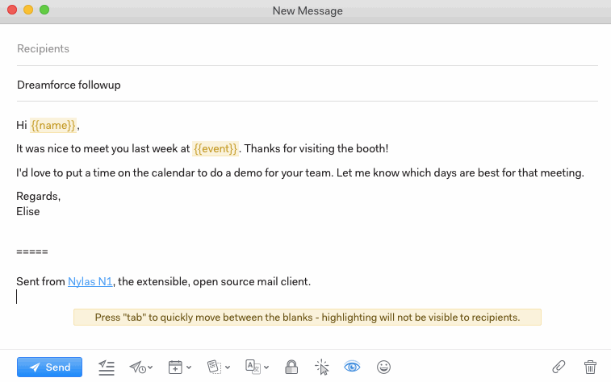

# Translating messages

Nylas Mail currently supports automated translation of messages written in English into Spanish, Russian, simplified Chinese, French, and German using the Yandex Translation API.

To translate a message, follow these steps:

1.  Activate the Translations plugin in Preferences > Plugins.
2.  Write your draft.
3.  Click the Translation icon at the bottom of the message window and choose your target language.

The translation plugin will translate the body of a single email and the signature only—not the full thread history.

