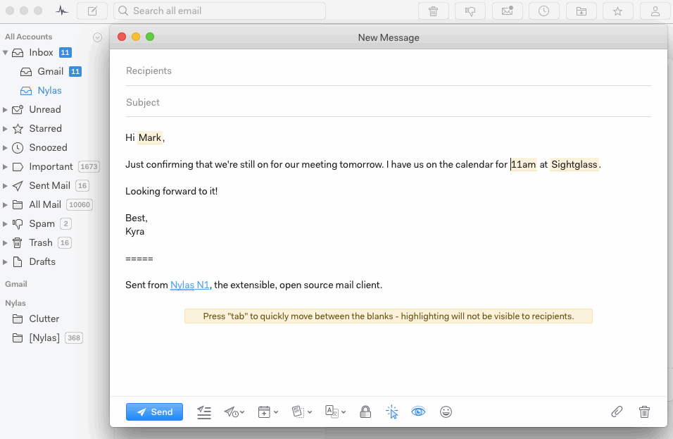

# Formatting messages

To make text within your messages **bold**, _italic_, or underlined, highlight the text you want to format and choose the appropriate option from the pop-up menu.

You can also add links to text. Highlight the text you want to link, then click the link option and type or paste the URL.

