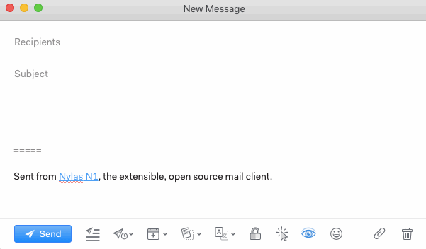

# Using emoji

To insert emoji into your message, click the emoji icon at the bottom of the message window and choose from the menu.

You can also type :emoji: with the colons and the emoji short names, Slack-style.

And, yes, both :poop: and :hankey: work for the poop emoji.

