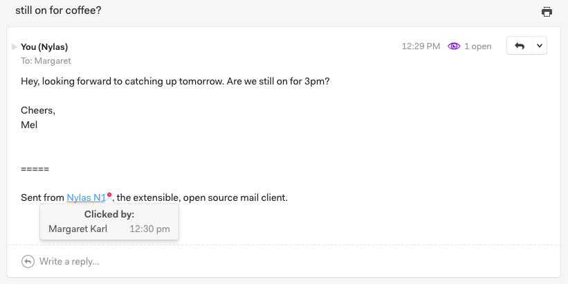

# Tracking links

To enable link tracking for a message, click the Link Tracking icon at the bottom of your message.

When messages you have tracked are clicked, notifications will appear in a feed above your list of accounts. Click the Activity icon to review your notifications.

You can also see whether a link has been clicked by looking at your sent mail. Links you’ve tracked will display a red circle to the right; when the link has been clicked, the circle will be filled in and will appear as a red dot. You can click the dot to view the activity for that link.

