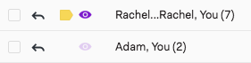
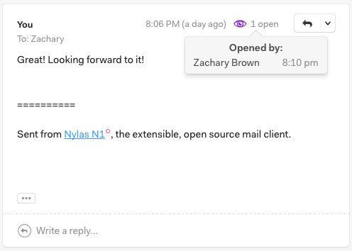

# Tracking sent messages

To enable open tracking, click the Open Tracking icon at the bottom of your message.

When messages you have tracked are opened, notifications will appear in a feed above your list of accounts. Click the Activity icon to review your notifications.

The open status will also appear next to the message in your inbox. If a message hasn’t been opened, the purple eye icon will be transparent. When it has been read, the eye icon will appear at full saturation.

You can also see whether a message has been opened by looking at your sent mail. The open status will appear at the top of the message. You can click the icon in the thread list or at the top of the message to view the activity for that message.

